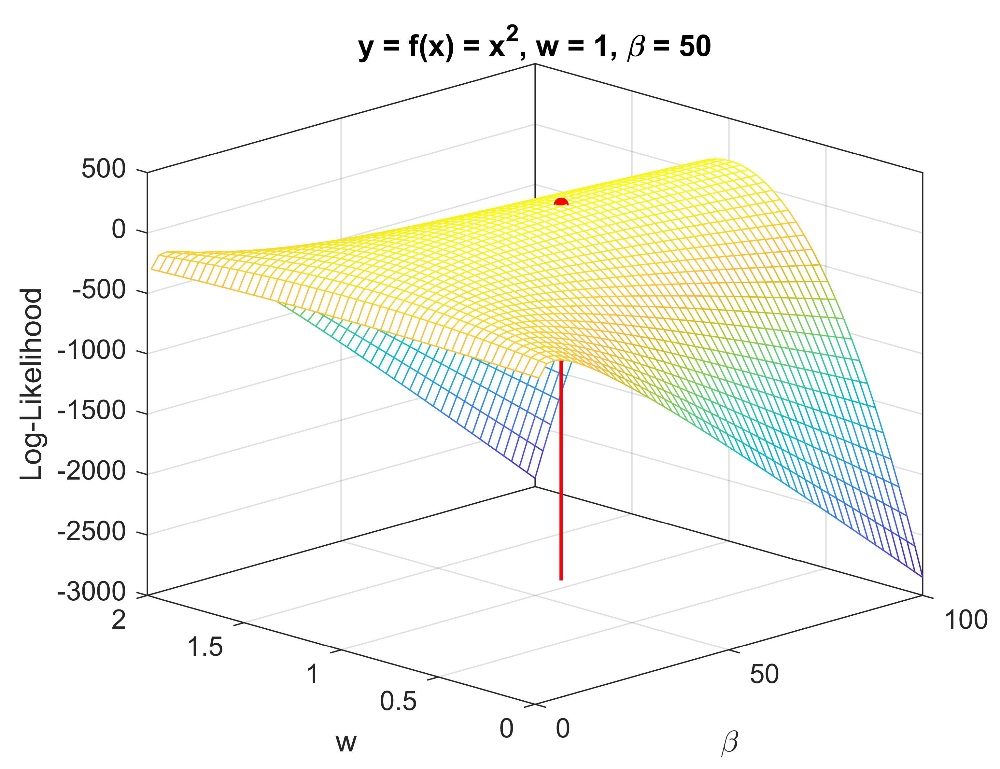

[Back to main page](bayesian_inference.md)

# Analytic Bayesian Inference

The exact analytical solution to the Bayesian linear regression problem is described in detail in the Wikipedia entry on [Bayesian Linear regression](https://en.wikipedia.org/wiki/Bayesian_linear_regression). We will thus refrain from explaining every mathematical detail on focus on the main steps and results.

### The Likelihood function

As mentioned before the likelihood function $L(\mathcal{D}\|w,\beta)$ describes the likelihood of observing the data $\mathcal{D}$ given the unknown parameters $w$ and $\beta$ according to our linear regression model. Since the measurement error follows a Normal distribution with zero mean, the probability of overserving a single data point (pair of $x$ and $y$) can be expressed as:

$$p(y|x,w,\beta) = \mathcal{N}(y|wf(x),\beta^{-1})$$

In words, we expect $y$ to be normally distributed with a mean at the model-predicted value of $y$ based on $x$, i.e. $wf(x)$, and a precision of $\beta$. If we now have a dataset $\mathcal{D}$ of $N$ data points, which are independent from each other (this is an important details of the model assumptions), we can simply multiply the individual probabilities to arrive at the overall likelihood

$$L(\mathcal{D}|w,\beta) = \prod_{i=1}^{N} \mathcal{N}(y_i|wf(x_i),\beta^{-1})=\left(\frac{\beta}{2\pi}\right)^{\frac{N}{2}}\exp\left[-\frac{\beta}{2}\sum_{i=1}^{N}(y_i-wf(x_i))^2\right]$$

Switching to vector notation where we define $x=(x_1,x_2,...,x_N)^T$ and $y=(y_1,y_2,...,y_N)^T$, i.e. both vectors have a single column, we can simplify the likelihood as follows:

$$L(\mathcal{D}|w,\beta) = \left(\frac{\beta}{2\pi}\right)^{\frac{N}{2}}\exp\left[-\frac{\beta}{2}\left(y^Ty-2wy^Tf(x)+f(x)^Tf(x)w^2\right)\right]$$

In future use, it will also be useful to have the log-likelihood which is defined as follows:

$$\log L(\mathcal{D}|w,\beta) = \frac{N}{2}\log \frac{\beta}{2\pi}-\frac{\beta}{2}\left[y^Ty-2wy^Tf(x)+f(x)^Tf(x)w^2\right]$$

The $\log$ refers to the natural logarithm with base $e$.

### Quick Detour: Maximum Likelihood

In a non-Bayesian (frequentist) treatment of the parameter estimation problem, the likelihood function would be maximised with respect to the unknown parameters. This is known as a Maximum-Likelihood (ML) approach and can be done analytically to get a point estimate of the unknown parameters:

$$w_{ML} = \left(f(x)^Tf(x)\right)^{-1}f(x)^Ty$$

$$w_{ML} = \left(f(x)^Tf(x)\right)^{-1}f(x)^Ty$$

Figure 1: Example of the Maximum-Likelihood approach, which the read line indicating the ML point estimate.

### The Prior Distribution

[Back to main page](bayesian_inference.md)

[Part 2: Variational Bayesian](BI_VB.md)

