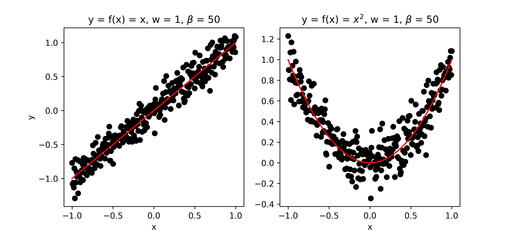

## Aim and Scope of this Tutorial

This tutorial exemplifies the use of approximate Bayesian inference with both a variational Bayesian (VB) and Markov Chain Monte Carlo (MCMC) approach on a very simple linear regression model. It is aimed at people who already have a basic understanding of probability theory including Bayes' rule, probability density functions and expectations and want to understand the inner workings, advantages and disadvantages of VB and MCMC approaches. 

There are a lot of tutorials on either approaches but I have not come across a tutorial that explains and describes both methods on the same model. I hope the following documents will fill this gap. The accompanying code in MATLAB and Python is also published. The described concepts are mainly taken from and expanded upon [Bishop's "Pattern Recognition and Machine Learning" (2006)](https://www.springer.com/gp/book/9780387310732).    

## Introduction

Bayesian inference is a powerful tool to identify a variety of statistical models from which we can make make predictions and quantify the uncertainties we have in those predictions. This uncertainty is expressed in terms of probabilities, in particular through the use of probability density functions (PDF). Throughout this tutorial we will only deal with continuous random variables whose PDF is denoted by $p$, having the property $\int p(x) dx = 1$.

### The Basic Model

In this tutorial, we will discuss the following basic linear regression model:

$$y = w f(x) + \varepsilon$$

$$\varepsilon \sim \mathcal{N}(0,\beta^{-1})$$

The input and output (or target) of the model are $x$ and $y$, respectively, and collectively referred to as data $\mathcal{D}$. The function $f$ can be any continuous function of the input $x$. The model has two unknown parameters that we want to infer from the data $\mathcal{D}$: the slope parameter $w$ and the precision $\beta$ (inverse of the variance) of the measurement noise $\varepsilon$. For the purpose of illustration we will assume the parameter $w$ to be one dimensional, so we can plot the parameter space.

Figure 1: Examples of some data generated by the model.

### Bayesian Inference

The goal of Bayesian inference in the context of this model is to infer the posterior distribution $p(w,\beta\|\mathcal{D})$ of the unknown parameters given some data. Using Bayes' rule this posterior can be calculated as follows:

$$p(w,\beta|\mathcal{D})=\frac{L(\mathcal{D}|w,\beta)p(w,\beta)}{P(\mathcal{D})}$$

The function $L(\cdot)$ expresses the likelihood of observing the data given the unknown parameters and the PDF $p(w,\beta)$ is the prior distribution over unknown parameters. It encompasses information we have on the unknown parameters before any data is observed. The function $P(\cdot)$ is called marginal likelihood and can be considered as evidence of observing the data given our model. It we would do Bayesian inference on different models, we could use it to compare them. $P(\cdot)$ is called marginal likelihood, as it can be calculated by summing over, also known as marginalising out, the unknown parameters from the numerator:

$$P(\mathcal{D})=\int L(\mathcal{D}|w,\beta)p(w,\beta) dw d\beta$$

Model (1) -(2) is actually simple enough so so that the posterior distribution and marginal likelihood can be calculated analytically. However, for more complex models this is not the case and we have to resort to approximate inference. For this particular example model, having the analytic solution is very useful as it allows us to compare the 'true' solution with the approximate results we get from VB and MCMC. 

The exact analytic solution is described [Part 1](BI_True.md).

The approximate solution using variational Bayesian is described in [Part 2](BI_VB.md).

The approximated solution using Markov Chain Monte Carlo is described in [Part 3](BI_MCMC.md).

